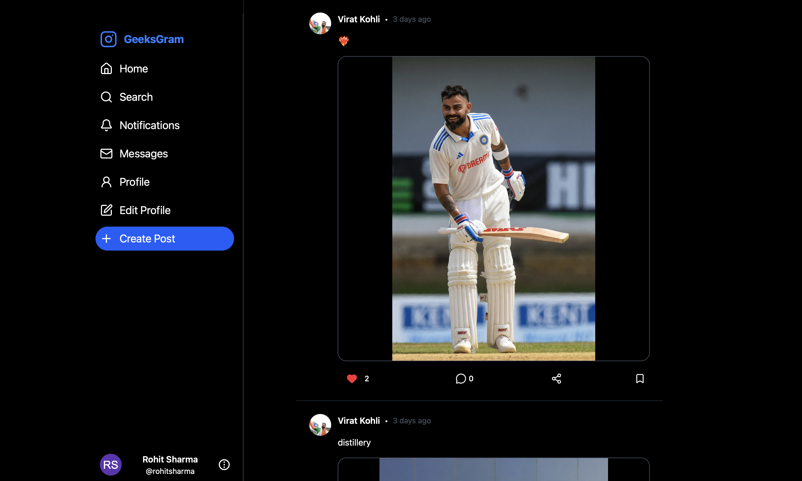

# GeeksGram – Social Media Frontend



A modern, **Instagram/Twitter-style social media app** frontend built with **React + Vite**, **Redux Toolkit**, **Tailwind CSS v4**, and **Socket.io**.  
This repo contains the client for **GeeksGram**, a real-time social platform with posts, likes, comments, follows, notifications, and 1:1 chat with **voice & video calls**.

[](https://geeksgram-by-prateet.vercel.app/)


---

## ✨ Features

### 🔐 Authentication & Security

- Email + password auth (frontend powered by **Redux Toolkit** thunks).
- **Gmail-only signup** with client-side validation.
- **Email OTP verification** flow:
  - `/signup` → `/email-verification` with OTP.
- **Login / Logout** with JWT token persisted in `localStorage`.
- **Forgot password** + **reset password with OTP** (pages already wired up: `ForgotPassword`, `EnterResetOtp`, `ResetPassword`).
- Global auth state via `authSlice`:
  - Handles register, login, email verification, profile update, followers/following, and current user profile.

### 👤 Profiles & Social Graph

- Personal profile page: `/profile`
  - Avatar, bio, stats, links (name, username, etc.).
  - User posts feed on profile.
- **Public profiles**: `/user/:username`
  - Loaded through `userSlice` (`fetchPublicProfile`).
  - **Follow / Unfollow** other users with real-time UI state.
  - Start chat directly from a user profile via **"Message"** button (creates or opens a DM chat).

### 📰 Feed & Posts

- **Home feed** (`/home`) with:
  - Infinite-style list of posts from followed users.
  - Handled via `postSlice` → `fetchFeed`.
- **Create post**:
  - Global **"Create Post"** button in the left sidebar opens `PostCard` modal.
  - Text + **image upload** (supports `FormData`).
  - Character limit enforced via `MAX_CAPTION_LENGTH`.
- **Post interactions**:
  - **Like / Unlike** with optimistic UI updates via `likePost` / `unlikePost`.
  - **Comments** with per-post loading/error state in `commentSlice`.
  - Quick **comment modal** (`CommentModal`) triggered from each `FeedCard`.
- Clean UI with avatars (generated via **DiceBear** if user avatar is missing).

### 🔔 Notifications

- Dedicated **Notifications** page `/notification`.
- Notifications for:
  - Likes (`like`)
  - Comments (`comment`)
  - Follows (`follow`)
- `notificationSlice` manages:
  - Fetching notifications.
  - `unreadCount` stored globally.
  - `markAllRead` when opening the notifications page.
- Left sidebar **bell icon shows red unread badge** using `selectUnreadCount`.
- Each notification is clickable:
  - Navigates to **post** or **user** depending on type.

### 💬 Messaging, Voice & Video Calls

- **Messages page** `/messages` with responsive layout:
  - Left: chat list (`Dm` + `Chats`).
  - Right: active chat (`ChatBox`) on desktop.
- **Mobile-friendly chat UX**:
  - On mobile, selecting a chat redirects to `/messages/:chatId` for a fullscreen chat experience.
- Real-time **1:1 chat**:
  - Messages loaded via REST; new messages delivered via **Socket.io** (`socket.js`).
  - New messages appended live using `"message:new"` event.
  - Image attachments supported in chat (`/messages/upload-image` endpoint).
- **Voice calls**:
  - Implemented with **WebRTC** using `VoiceCallModal`.
  - Uses `navigator.mediaDevices.getUserMedia` (audio only).
  - Socket events: `voice:offer`, `voice:answer`, `voice:ice-candidate`, `voice:end`.
- **Video calls**:
  - Implemented with **WebRTC** using `VideoCallModal`.
  - Socket events: `call:offer`, `call:answer`, `call:ice-candidate`, `call:end`.
  - Local + remote video streams, mute/camera toggle, call end handling.

### 🔎 Search

- `/search` page backed by `SearchCard`:
  - Debounced search input (via `useDebounce`).
  - Uses `userSearchSlice` + `searchUsers` thunk.
  - Results list with avatar, name, username.
  - Navigate to `/profile` if current user; `/user/:username` otherwise.

### 🧭 Layout & Navigation

- Responsive layout built with **Tailwind CSS v4** utility classes.
- **Left sidebar (`Left.jsx`)**:
  - App logo + name (`APP_NAME = "GeeksGram"`).
  - Nav items: Home, Search, Notifications, Messages, Profile, Edit Profile.
  - **Mobile nav drawer** with hamburger menu (`Menu` / `X` icons).
  - Global **Create Post** button opens `PostCard`.
  - User dropdown (profile info + logout).
- Smart navigation:
  - If user clicks on an already active nav item, the page **refreshes via `window.location.reload()`**.
- Global toasts via **react-hot-toast** for feedback.

---

## 🛠 Tech Stack

**Frontend**

- [React](https://react.dev/)
- [Vite](https://vitejs.dev/)
- [React Router DOM](https://reactrouter.com/)
- [Redux Toolkit](https://redux-toolkit.js.org/) + `react-redux`
- [Tailwind CSS v4](https://tailwindcss.com/)
- [Axios](https://axios-http.com/)
- [Socket.io Client](https://socket.io/)
- [Moment.js](https://momentjs.com/) for date/time formatting
- [lucide-react](https://lucide.dev/) for icons
- [react-hot-toast](https://react-hot-toast.com/) for toast notifications

**Realtime & Calls**

- **Socket.io** for events (messages, calls, notifications).
- **WebRTC** for peer-to-peer voice & video calls.

**Deploy**

- Designed to be deployed on **Vercel** (already includes `vercel.json`).

---

## 📁 Project Structure

High-level structure:

```bash
socialmedia-frontend/
├── public/
├── src/
│   ├── components/
│   │   ├── Left.jsx
│   │   ├── FeedCard.jsx
│   │   ├── PostCard.jsx
│   │   ├── Notification.jsx
│   │   ├── ChatBox.jsx
│   │   ├── Dm.jsx
│   │   ├── VideoCallModal.jsx
│   │   ├── VoiceCallModal.jsx
│   │   ├── UserProfile.jsx
│   │   ├── ProfileCard.jsx
│   │   ├── ProfileInfo.jsx
│   │   ├── CommentModal.jsx
│   │   ├── SearchCard.jsx
│   │   └── Logo.jsx
│   ├── pages/
│   │   ├── Home.jsx
│   │   ├── Login.jsx
│   │   ├── Signup.jsx
│   │   ├── Profile.jsx
│   │   ├── Notifications.jsx
│   │   ├── Messages.jsx
│   │   ├── Search.jsx
│   │   ├── ForgotPassword.jsx
│   │   ├── ResetPassword.jsx
│   │   ├── EmailVerification.jsx
│   │   ├── EnterResetOtp.jsx
│   │   ├── Edit.jsx
│   │   └── NotFound.jsx
│   ├── redux/
│   │   ├── store.js
│   │   ├── authSlice.js
│   │   ├── postSlice.js
│   │   ├── userSlice.js
│   │   ├── userSearchSlice.js
│   │   ├── commentSlice.js
│   │   └── notificationSlice.js
│   ├── utils/
│   │   ├── constants.js
│   │   ├── dicebear.js
│   │   └── time.js
│   ├── hooks/
│   │   ├── useClickOutside.js
│   │   └── useDebounce.js
│   ├── socket.js
│   ├── App.jsx
│   ├── main.jsx
│   └── index.css
├── package.json
├── vite.config.js
├── vercel.json
└── README.md